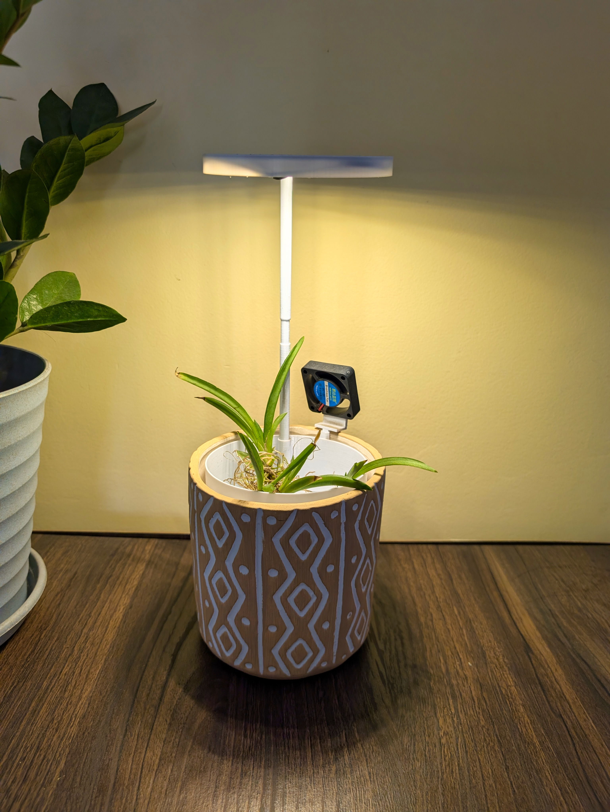
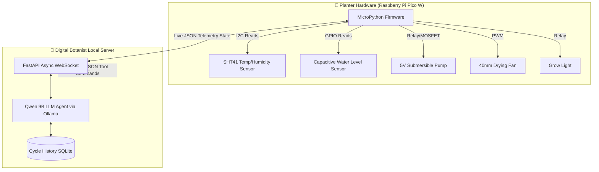

<div align="center">

# 🌸 Smart Tolumnia Planter V1

### *The Unnecessarily Intelligent Epiphyte Bioreactor*

An intelligent, two-tiered 3D-printed enclosure with an **autonomous Qwen-powered AI agent** that perfectly orchestrates the strict flood-and-bone-dry cycles required by bare-root Tolumnia orchids... because watering plants with a spray bottle is *so* last century.

<br>

<p align="center"><i>Note: The brown tips visible on the Tolumnia leaves in the image above are due to long shipping transits, not the setup. The plant recovers once the automated watering loop is established.</i></p>
<br><br>

---

**Part of the *Over Engineered by Venky* Series**

> *Welcome to "Over Engineered by Venky", a growing collection of projects where the solution is gloriously, unapologetically disproportionate to the problem. Need to water a notoriously finicky Tolumnia orchid? Sure, a $10 hardware timer might work. But why not deploy a Pico W, a custom 3D-printed twin-tier reservoir, PWM-controlled micro-climate fans, and a 9-Billion parameter Neural Network that mathematically calculates Vapor Pressure Deficit (VPD) to trigger synthetic flood cycles? Efficiency? Optional. Style points? Mandatory.*

---

[](#)
[](https://micropython.org/)
[](https://www.raspberrypi.com/products/raspberry-pi-pico/)
[](https://ollama.com/)

</div>

---

## 📖 The Philosophy: Why Tolumnia? Why an AI?

Tolumnia orchids are notoriously difficult to keep alive in a standard home environment. As miniature epiphytes from the Caribbean, they demand a very specific and unforgiving mechanical cycle: their roots must be absolutely drenched in water, and then rapidly, completely dried out. They explicitly abhor sitting in soggy media—hence, keeping them completely **bare root**. 

Doing this manually requires extreme discipline: daily 15-minute drenching sessions followed by ensuring ample airflow so the velamen layer (the spongy epidermis of orchid roots) dries out immediately. Forget for a few days, and they shrivel into dust. Leave them wet overnight, and the roots instantly turn to mush and the plant rots. 

**The Evolution:** This project completely removes human fallibility by creating an enclosed, fully automated micro-environment where these ruthless biological laws are algorithmically enforced by a Local Large Language Model. We aren't just turning a pump on and off; we are simulating the evaporative cycles of the Caribbean using a hyper-advanced "Digital Botanist."

---

## 🆚 The Problem vs. The Over-Engineered Solution

**The Normal Solution:** Buy a $10 programmable timer plug that turns a tiny water pump on for 1 minute every 24 hours, and runs a fan for an hour afterwards. It has no idea if the air is humid, if the roots are actually dry, or if the sun has set. It just blindly pumps.

**The Venky Solution:** A custom 3D-printed two-tiered inner structure sitting inside a premium thermal clay pot. A Raspberry Pi Pico W orchestrates a 5V submersible pump, a high-CRI grow light, and a 40mm micro-fan. The Pico W streams live telemetry over WebSockets to an asynchronous FastAPI Python server. This server queries a local Qwen 9B LLM. The AI cross-references ambient room humidity, temperature, and calculated Vapor Pressure Deficit (VPD) to enforce a mandatory 15-minute root tissue soak, before deciding the exact optimal duration of the aggressive dry cycle.

Because why guess if the roots are dry when a neural network can calculate the exact atmospheric evaporation rate?

---

## 🏗️ Hardware Architecture & The Enclosure

The physical system uses a custom **Two-Tiered 3D Printed Structure** nested inside an **Outer Clay Pot**:

### 1. The Outer Clay Pot
Houses the entire plastic assembly. Provides critical thermal mass and insulation for the water reservoir against extreme room temperatures, preventing the nutrient solution from heating up. It also maintains a clean, premium, natural aesthetic that belies the ridiculous amount of silicon inside it. The entire setup is designed to be completely wire-free from the outside, hiding all messy electronics and routing cables internally through the dual-tier structure for a sleek, living-room-ready look.

### 2. Bottom Tier (The Reservoir)
A 3D-printed inner section holding the nutrient water mixture. 
* Houses a micro submersible 5V water pump.
* Houses a **Capacitive Water Level Sensor** attached to the Pico W. If the water level drops too low, the hardware layer strictly blocks the pump to prevent it from running dry and burning out, regardless of what the AI demands.

### 3. Top Tier (The Orchid Chamber)
A 3D-printed inner basket holding the bare-root orchid. 
* Designed with aggressive, rapid-drainage holes leading straight back down to the reservoir. 
* Mounts the 40mm PWM cooling fan to blast the roots dry.
* Mounts the overhead high-CRI grow light.
* Mounts the ultra-precise **Sensirion SHT41 Temp/Humidity Sensor**, which acts as the "lungs" of the operation.

<div align="center">
  <br>
  
  <br>
  <i>The 15-Minute Synthetic Ecosystem Flood Triggered by Qwen</i>
  <br><br>
</div>



---

## 🤖 The Autonomous "Botanist" Agent

Unlike a brittle Python script with endless `if/else` statements, the Agent operates on a continuous, biologically aware **OODA Loop (Observe, Orient, Decide, Act)**:

### 1. Perception & Beliefs
The agent constantly monitors the micro-climate via the SHT41. The FastAPI middle-layer mathematically calculates the **Saturation Vapor Pressure (SVP)** and the **Actual Vapor Pressure (AVP)** to derive the true **Vapor Pressure Deficit (VPD)** before handing the context over to Qwen. 

### 2. Reasoning & Planning (The Biological Directives)
Armed with its beliefs, the Qwen 9B LLM enforces strict botanical laws baked directly into its system prompt:
* **The 15-Minute Rule:** A flood cycle is useless if the velamen tissue doesn't have time to absorb it. The AI must structure any pump activation to guarantee a strict 15-minute minimum soak.
* **The Nighttime Veto:** Tolumnias absolutely *cannot* be watered at night, or the temperature drop will cause crown rot. If the roots are bone dry but the sun has set, the AI will actively suppress its own watering urges, logging a delay until sunrise.
* **VPD Cooling:** During heatwaves (>30°C), the AI proactively triggers the 40mm fan to provide cooling drafts independent of the watering cycle, preventing the plant from entering heat dormancy and encouraging early flowering.

### 3. Action (JSON Tool Calling)
The LLM mathematically justifies its plan and outputs a strict JSON array representing Python function executions:
- `{"tool": "trigger_flood", "kwargs": {"duration_minutes": 15}}`: Submerges the roots via the water pump relay.
- `{"tool": "set_fan_speed", "kwargs": {"percent": 100, "duration_minutes": 45}}`: Blasts the roots bone-dry using PWM control.
- `{"tool": "set_grow_light", "kwargs": {"state": "ON"}}`: Controls the synthetic sun.

---

## 📸 Inside the AI's Mind

Because this is a reasoning agent, you don't just get `[INFO] Pump ON`. You get the exact biological reasoning trace logged in real-time. Here's what goes through its head on a dangerously hot afternoon:

```json
[BOTANIST LOG] SHT41 Telemetry: Temp 31.5°C, Humidity 45%. Water Level: OK.
[BOTANIST LOG] Calculated VPD: 1.9 kPa (High).
[QWEN AGENT] PERCEIVE: Extreme Heat Stress. Velamen is likely completely desiccated. It is 14:00 (Daytime) - safe to water. 
[QWEN AGENT] REASONING: Situation Critical - The high VPD (1.9 kPa) is causing rapid transpiration. I must initiate an immediate flood cycle for tissue absorption. Following that, I must aggressively engage the PWM fan to drop the ambient micro-climate temperature through evaporative cooling to prevent heat dormancy.
[QWEN AGENT] PLAN: [{"tool": "trigger_flood", "kwargs": {"duration_minutes": 15}}, {"tool": "set_fan_speed", "kwargs": {"percent": 80, "duration_minutes": 60}}]
[BOTANIST LOG] Dispatching WebSocket tool commands to Pico W -> SUCCESS
```

---

## 🖨️ 3D Printing the Planter

All structural models and STL assemblies for the custom micro-climate bioreactor are provided in the repository. The assembly is specifically engineered to cradle the bare roots securely while guaranteeing zero water-pooling after the pump halts.

* **[Bottom Reservoir (`bottom_reservoir.stl`)](hardware/stls/bottom_reservoir.stl):** Houses the 5V pump and acts as the water reserve. Print with 3+ perimeters to ensure it is 100% watertight.
* **[Top Orchid Chamber (`top_orchid_chamber.stl`)](hardware/stls/top_orchid_chamber.stl):** The aggressively drained upper basket supporting the bare-root setup.
* **[Fan Mount Assembly (`fan_mount_angle.stl` & `fan_mount_clip.stl`)](hardware/stls/fan_mount_angle.stl):** Mechanical brackets used to securely snap the 40mm PWM cooling fan onto the top chamber.
* **[Grow Light Assembly (`grow_light_hood.stl`, `grow_light_support_arm_1.stl`, `grow_light_support_arm_2.stl`)](hardware/stls/grow_light_hood.stl):** Casing and vertical support poles to position a ring-style high-CRI LED halo exactly over the foliage without blocking the SHT41.

---

## 💻 Tech Stack & Software

- **Local Server**: A lightweight `FastAPI` instance running a bidirectional WebSocket endpoint (`/ws/telemetry`).
- **AI Backend**: `Ollama` running locally, utilizing the `qwen2.5:9b` instruct model (or whichever reasoning model fits on your GPU).
- **Firmware**: Custom `MicroPython` script on the Pico W using `uasyncio` to simultaneously poll I2C sensors, manage WebSocket keep-alives, and operate hardware relays.
- **State Persistence**: Minimal `SQLite` architecture storing the historical Timestamped Telemetry, Agent Plans, and Action execution logs so the AI can literally reflect on its past decisions.

---

## 🚀 Installation & Setup

### 1. The Server (Digital Botanist)
You need a machine with Python 3.10+ (preferably with a GPU for Ollama).

```bash
cd server
python -m venv venv
source venv/bin/activate  # Or `venv\Scripts\activate` on Windows
pip install -r requirements.txt
```

**Install Ollama and Pull the Model:**
1. Install [Ollama](https://ollama.com/download) for your OS.
2. Pull the model: `ollama run qwen2.5:9b` (or modify `agent.py` to use a smaller model if needed).

**Run the Server:**
```bash
uvicorn main:app --host 0.0.0.0 --port 8000
```
*Note the IP address of this machine on your local network (e.g., `192.168.1.100`).*

### 2. The Firmware (Pico W)
1. Flash your Raspberry Pi Pico W with the latest [MicroPython firmware](https://micropython.org/download/RPI_PICO_W/).
2. Copy `firmware/config.example.py` to `firmware/config.py`.
3. Edit `config.py` with your WiFi credentials and the IP address of your FastAPI server.
4. Install `uwebsockets` onto the Pico using `mip` or Thonny.
5. Upload `main.py` and `config.py` to the Pico.

### 3. Hardware Wiring (Pin Reference)
- **SHT41 Temp/Humidity (I2C):** SDA -> `GPIO 4`, SCL -> `GPIO 5`
- **Capacitive Water Level:** Signal -> `GPIO 14` (Set to pull LOW when wet)
- **5V Submersible Pump:** Logic MOSFET -> `GPIO 15`
- **Grow Light Relay:** Logic -> `GPIO 16`
- **40mm Fan PWM:** Logic MOSFET -> `GPIO 17`

---

## 💰 Bill of Materials (BOM)

| # | Component | Specs | Qty | Notes |
|---|---|---|---|---|
| 1 | Raspberry Pi Pico W | RP2040, Wi-Fi | 1 | The sensory edge node |
| 2 | 3D Printed Planter | 2-Tier Inner Core | 1 | Custom STL holding roots and reservoir |
| 3 | Outer Clay Pot | Ceramic | 1 | Thermal mass and premium aesthetics |
| 4 | 5V Submersible Pump | Mini Water Pump | 1 | Synthesizes the 15-min flood cycle |
| 5 | 40mm PWM Fan | 5V DC micro fan | 1 | Forced-air root drying & VPD cooling |
| 6 | Grow Light | LED High-CRI Strip| 1 | Drives photosynthesis |
| 7 | **SHT41 Sensor** | I2C Temp & Humid | 1 | The ultra-precise lungs of the operation |
| 8 | **Capacitive Water Level** | Non-contact | 1 | Prevents catastrophic dry-running |
| 9 | Logic Level MOSFETs | IRLZ44N & Relays | 3 | High-current switching for pump/fan/light |
| 10| Silicone Tubing | 6mm/8mm | 1M | Water routing from pump to top tier |


<div align="center">

**Over Engineered with 💚 by Venky**

*Because manual watering is a single point of failure.*

</div>
